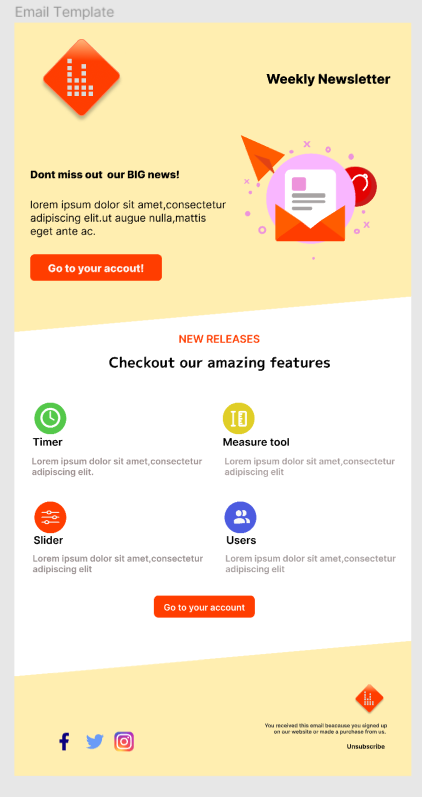

# UI-UX-Design-Task-2
This provides a comprehensive look at the content and purpose of your weekly newsletter, showcasing the excitement of new features while emphasizing user engagement and customization.

## Design Screenshots

Figma: [Link to Figma](https://www.figma.com/file/r68cdp9GklDpES8gUsu3Pz/CodSoft-Task-2?type=design&node-id=0%3A1&mode=design&t=IDTBFXp30RYFZ0k1-1)

# Weekly Newsletter

Stay Updated with Our Weekly Newsletter!

## New Releases

Check out our amazing new features and updates:

### Timer

A handy timer feature to help you keep track of time.

### Measure Tool

Introducing the Measure Tool for precise measurements and calculations.

### Slider

Explore the new Slider functionality for enhanced user interactions.

### Users

Connect and collaborate with other users seamlessly.

